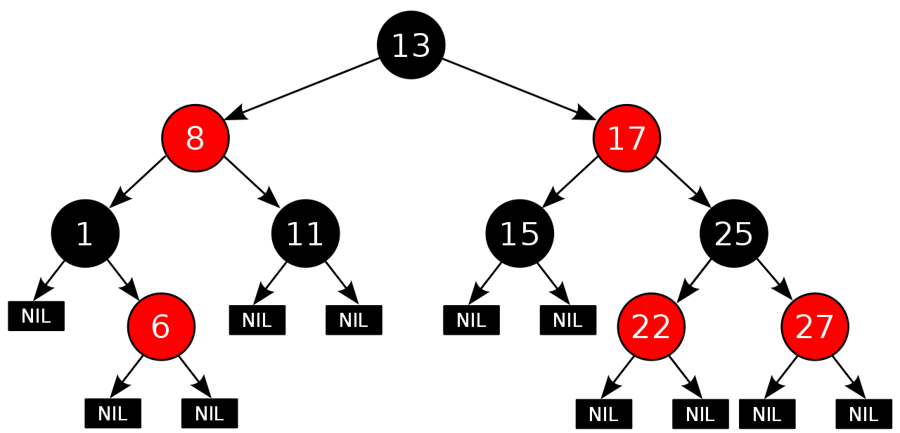

## Red-Black Tree

> 이진탐색트리의 일종으로 최악의 경우 시간복잡도가 O(N)이 되는데 이를 방지하기 위한 것.
>
> 레드블랙트리는 SEARCH, INSERT, DELETE 연산의 최악의 경우에도 O(logN)을 항상 유지시켜준다.
>
> 트리의 높이에 시간복잡도는 비례한다.

* 이진탐색트리의 최악의 경우
  * 한쪽으로 치우치는 경우가 발생할 경우(왼쪽은 작은 것, 오른 쪽은 큰 것을 두는 구조)
  * 이 경우, 트리의 높이는 `N`이 되고 최악의 경우 `O(N)`이 시간복잡도가 됨 
  * 정렬된 것이 들어오면 이런경우가 되는데 현실에서 그럴 가능성이 높음
  * 이를 방지하기 위해, 트리의 균형을 맞춰가면서 수정을 하는 것이 바로 Red-Black Tree이다.

###  Red-black Tree 정의 

* 자식노드가 존재하지 않는 경우 NIL노드를 가정, 따라서 모든 리프노드는 NIL노드

* 루트의 부모도 NIL노드라고 가정(실제로 구현하는 건 아님! 설명용)

* 결국, 노드는 내부노드와 NIL노드로 분류

* 다음의 조건을 만족하는 이진탐색트리: 

  1) 각 노드는 red 혹은 black이고,

  2) 루트노드는 black이고,

  3) 모든 리프노드(즉, NIL노드)는 black이고,

  4) red노드의 자식노드들은 전부 black, red노드는 연속해서 등장 하지 않음

  5) 모든 노드에 대해서 그 노드로부터 자손인 리프노드에 이르는 모든 경로에는 동일한 개수의 black 노드가   존재한다.

  
  
  
  
  ​																[레드-블랙 트리]

​																							[조건 5]

### 레드-블랙 트리의 높이

(조건을 만족시키면 트리의 높이는 자동으로 보장된다!)

* 노드 x의 높이 h(x)는 자신으로부터 리프노드까지의 가장 긴 경로에 포함된 에지의 개수이다.

* 노드 x의 블랙-높이 bh(x)는 x로부터 리프노드까지의 경로상의 블랙노드의 개수이다(노드 x자신은 불포함)

* 높이가 h인 노드의 블랙-높이는 bh>=h/2이다.
  * 조건 4에 의해 레드노드는 연속 될 수 없기 때문에

* 노드 x를 루트로 하는 임의의 서브트리는 적어도 2^bh(x)-1개의 내부노드를 포함한다 (수학적 귀납법)

* n개의 내부노드를 가지는 레드블랙트리의 높이는 2log(n+1) 이하이다.

* n>=2^bh-1 >=2^h/2-1 이므로, 여기서 bh와 h는 각각 루트 노드의 블랙-높이와 높이

 

### SEARCH

* BST와 같음

### INSERT

* LEFT and RIGHT Rotation을 이용해 이진 탐색 트리의 특성을 유지한다.

  

* 새로운 노드 z를 RED노드로 추가한다.

* `Red-Black Tree`의 기본 조건들을 위반하는 지 살펴본다.

  * 1. OK
    2.  만약 새 노드가 루트노드라면 위반, 아니면 OK
    3.  OK
    4.  z의 부모 p[z]가 red이면 위반
    5.  OK

  #### INSERT의 시간복잡도

	* BST에서의 INSERT : O(logN)
	* Red-Red인 경우만 움직이는 알고리즘이 작동해야 하기 때문에
	  * LEFT and RIGT Rotation을 하는 동안 2레벨 상승하거나, 1만 걸리기 때문에 트리의 높이에 비례하는 시간인 O(logN)이 걸린다.
	
	
	
	.assets/image-20210115223828531.png)

### DELETE 

* LEFT and RIGHT Rotation을 이용해 이진 탐색 트리의 특성을 유지한다.
* BST트리의 삭제처럼 진행, 만약 삭제된 노드가 Red면 그냥 종료
* 아니라면 조건 검사
* `Red-Black Tree`의 기본 조건들을 위반하는 지 살펴본다.
  * y가 삭제 노드
  * 여기서 x는 y가 자식이 있었을 경우 그 자식노드, 없었을 경우 NIL노드
  * 두 경우 모두 p[x]는 원래 p[y]였던 노드		-> BST DELETE에 따라서
    1. OK

    2. y가 루트였고 x가 red인 경우 위반 -> 그냥 root를 블랙으로 바꾸면 됨

    3. OK

    4. p[y]와 x가 모두 red일 경우 위반 -> 그냥 블랙으로 바꾸면 됨

    5. 원래 y를 포함했던 모든 경로는 이제 black 노드가 하나 부족

       1) 노드 x에 `extra black`을 부여해서 일단 조건 5 만족

       2) 노드 x는 `double black` 혹은 `red&black`

* 5번 해결법

  * extra black을 트리의 위쪽으로 올려보냄
  * x가 red&black 상태가 되면 그냥 black 노드로 만들고 끝냄
  * x가 루트가 되면 그냥 extra black을 제거

  

#### DELETE 시간복잡도

* O(logN)

---

* 면접 질문
  - 레드블랙트리를 사용하는 이유?
  - 레드블랙트리 조건 ?
  - 이진탐색트리의 한계? 한계점을 극복하기 위한 반복

---

* 출처 :  

https://www.youtube.com/watch?v=gF20ZSplxZE

https://ko.wikipedia.org/wiki/%EB%A0%88%EB%93%9C-%EB%B8%94%EB%9E%99_%ED%8A%B8%EB%A6%AC

